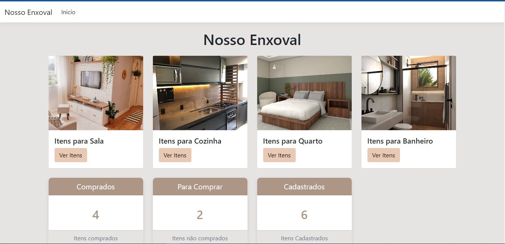

## Enxoval Pro
O Enxoval Pro é uma plataforma digital projetada para auxiliar pessoas que estão iniciando uma nova casa a gerenciar eficientemente seu estoque de enxoval. 



 ## Como funciona ?🚀
- Cadastro de Itens: Os usuários podem cadastrar novos itens de enxoval facilmente, definindo detalhes como nome, descrição, quantidade necessária e local de uso (sala, cozinha, quarto, banheiro).

- Edição de Itens: O sistema permite editar as informações de cada item, facilitando a atualização de quantidades, especificações e outras características conforme necessário.

- Estado de Compra: Cada item pode ter seu estado de compra definido como "comprado" ou "não comprado". Isso ajuda a visualizar rapidamente quais itens já foram adquiridos e quais ainda precisam ser comprados.

- Lista de Compras: O sistema gera uma lista de compras dinâmica com base nos itens marcados como "não comprados". Essa lista ajuda os usuários a planejar suas compras de maneira eficiente e a evitar a compra de itens desnecessários.

- Histórico de Compras: Mantém um histórico detalhado das compras realizadas, permitindo que os usuários acompanhem quando e onde os itens foram adquiridos, além de fornecer informações sobre preços e quantidades.

- Relações de Compra: O sistema facilita o acompanhamento das relações entre itens comprados e aqueles que estão pendentes. Isso permite uma visão clara do que já foi adquirido e o que ainda está em espera, auxiliando no planejamento de futuras compras.

- Relatórios de Estoque: Fornece relatórios detalhados sobre o estoque atual, incluindo itens comprados, pendentes e suas quantidades. Isso ajuda os usuários a manterem um controle rigoroso do seu enxoval.


## Tecnologias Utilizadas
- **Linguagem de Programação:** C#
- **Framework Web:** ASP .NET MVC
- **Banco de Dados:** MySQL

## Instalação e Configuração

- **Clone o repositório:**
 ``` bash
   git clone https://github.com/DanielCamargo1/EnxovalProMvc.git
  ```
- **Instale Os Nuget´s No Visual Stúdio**
   - Microsoft.EntityFrameWorkCore;
   - Microsoft.EntityFrameWorkCore.Design;
   - Microsoft.EntityFrameWorkCore.Tools;
   - Pomelo.EntityFrameWorkCore.MySql;
 
     Agora é só rodar o projeto e testar as funcionalidades 😉
